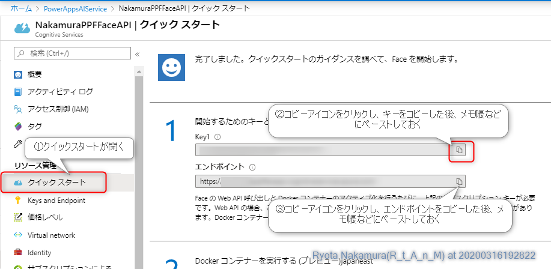
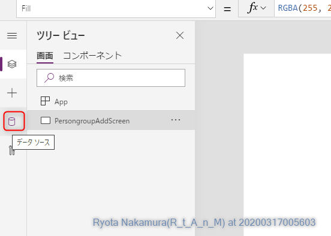

Power Apps Hands on
---

# 1. 環境準備/ログイン

## 1.1. Power Apps コミュニティプランの新規作成

既にコミュニティプランをお持ちの方は<br>
スキップしていただいて構いません。

1. Power Apps コミュニティプラン サイトにアクセスする<br>
https://powerapps.microsoft.com/ja-jp/communityplan/

2. 「無料で今すぐ開始」をクリックする


3. サインアップを行う

※gmailやhotmailなどは使用できません。

4. `電話もしくはSMS認証を行う


5. 取得した認証コードを入力して認証を行う


6. アカウントの詳細を入力して「開始」をクリックする


## 1.2. Azure の新規登録

既にAzureをご利用中の場合はスキップして頂いて<br>
構いません。

1. azure にアクセスする <br>
https://azure.microsoft.com/ja-jp/

2. 「無料アカウント」をクリックする <br>


3. 「無料で始める」をクリックする<br>


4. Microsoft アカウントもしくは GitHub アカウント にて認証する<br>


5. 各種必要事項を入力し、サインアップをクリックする


# 2. Azure側の準備

## 2.1. リソースグループの作成

1. リソースグループをクリックする<br>


2. 「追加」をクリックする<br>


3. リソースグループのパラメータを指定する<br>


4. 作成をクリックする。<br>


## 2.2. ストレージアカウントの作成

1. 作成したリソースグループから「追加」をクリックする<br>


2. ストレージアカウントを選択する<br>


3. ストレージアカウントのパラメータを指定する<br>


4. 作成をクリックする。<br>


## 2.3. Face APIの作成

1. 作成したリソースグループから「追加」をクリックする<br>


2. Faceを選択する<br>


3. 作成をクリックする<br>


4. Faceのパラメータを指定する<br>


# 3. Power Apps のみで顔認証アプリを作成する

## 3.1. Azure 上の準備

1. 作成済みのストレージアカウントを開く<br>


2. コンテナーを開く<br>


3. コンテナーを作成する<br>


4. ストレージアカウントのアクセスキーを取得する<br>


5. 作成済みのFace APIを開き、アクセスキーを取得する<br>



## 3.2. Power Apps 編集画面を起動

1. Power Apps を開く<br>


2. キャンパスアプリを一から作成をクリック<br>


3. アプリをタブレットモードで作成する<br>


4. Power Apps 編集画面が起動する<br>


## 3.3. 各種画面の作成

### 3.3.1. Person Group 作成画面
Face API の顔認証を行う為には、ユーザーを登録するための Person Groupをあらかじめ作る必要があるため、その画面を作成します。

1. 画面名の変更<br>


2. データソースを開く<br>


3. Face API を選択する<br>


4. 初回利用時は認証情報が必要となるので、メモ帳にペーストした内容を適宜入力する<br>


5. ツリービューに戻る<br>


6. Person Group ID を指定する入力ボックスを作成する<br>


7. 作成した入力ボックスの名称を「PersonGroupIDInput」に変更する<br>


8. PersonGroupIDInputのプロパティを以下のように変更する。<br>

|プロパティ名|日本語名|値|
|:--|:--|:--|
|Default|既定||
|HintText|ヒントのテキスト|セットするPerson Group IDを入力してください|


9. PersonIDInputのラベルを作成する<br>


|プロパティ名|日本語名|値|
|:--|:--|:--|
|Text|テキスト|Person Group ID|


10. 同様にPerson Group Nameを入力するテキストボックス(PersonGroupNameInput)とラベルを作成する。<br>


11. 登録用のボタン(PersonGroupSubmitButton)を作成する。<br>


|プロパティ名|日本語名|値|
|:--|:--|:--|
|Text|テキスト|登録|


12. PersonGroupSubmitButton の OnSelect プロパティに以下を指定する。

``` php
//Person Group 作成処理
FaceAPI.CreatePersonGroup(PersonGroupIDInput.Text,PersonGroupNameInput.Text);

//PersonAddScreen に移動
Navigate(PersonAddScreen,ScreenTransition.Fade)
```

13. PersonGroupSubmitButton の DisplayMode プロパティに以下を指定する。

``` php
//IDとNameが未入力の場合はボタン操作を無効化する
If(Or(IsBlank(PersonGroupIDInput.Text),IsBlank(PersonGroupNameInput.Text)),DisplayMode.Disabled,DisplayMode.Edit)
```

### 3.3.2. Person 作成画面

1. 新たに空の画面を作成し、PersonAddScreenとする。<br>


2. データソースを開く<br>

3. Azure Blob Storage を選択する<br>


4. 初回利用時は認証情報が必要となるので、メモ帳にペーストした内容を適宜入力する<br>


5. カメラコントロールを追加し、名前を PersonAddCam に変更する。<br>


6. 複数のカメラがある場合の選択用として、ドロップダウンボックス（PersonAddCamSelect）を作成する<br>


|プロパティ名|日本語名|値|
|:--|:--|:--|
|Items|--|[0,1,2]|
|Default|既定|0|

7. PersonAddCam のプロパティを以下のように変更する<br>

|プロパティ名|日本語名|値|
|:--|:--|:--|
|Camera|カメラ|PersonAddCamSelect.SelectedText.Value|
|StreamRate|ストリームレート|100|

8. Person Nameを入力するテキストボックス(PersonNameInput)とラベルを作成する。<br>

|プロパティ名|日本語名|値|
|:--|:--|:--|
|Default|既定||
|HintText|ヒントのテキスト|セットするPerson Nameを入力してください|

9. 登録用のボタン(PersonSubmitButton)を作成する。<br>

|プロパティ名|日本語名|値|
|:--|:--|:--|
|Text|テキスト|登録|


10. PersonSubmitButton の OnSelect プロパティに以下を指定する。

``` php
//Person データ作成
Set(PersonID,FaceAPI.CreatePerson(PersonGroupIDInput.Text,PersonNameInput.Text));

//顔認証登録用イメージアップロード
AzureBlobStorage.CreateBlockBlob("<コンテナー名>","learn.jpg",PersonAddCam.Stream);

//顔認証登録用イメージURL生成
Set(learnimageuri,AzureBlobStorage.CreateShareLinkByPath("<コンテナー名>/learn.jpg"));

//顔認証用イメージ登録
FaceAPI.AddPersonFace(PersonGroupIDInput.Text,PersonID.personId,learnimageuri.WebUrl);

//FaceAuthenticationScreen に移動
Navigate(FaceAuthenticationScreen,ScreenTransition.Fade)
```

11. PersonSubmitButton の DisplayMode プロパティに以下を指定する。

``` php
//Nameが未入力の場合はボタン操作を無効化する
If(IsBlank(PersonNameInput.Text),DisplayMode.Disabled,DisplayMode.Edit)
```

### 3.3.3. 顔認証画面

1. 新たに空の画面を作成し、FaceAuthenticationScreenとする。<br>

2. ドロップダウンボックス（AuthenticateCamSelect）を作成する<br>

|プロパティ名|日本語名|値|
|:--|:--|:--|
|Items|--|[0,1,2]|
|Default|既定|0|

3. カメラコントロールを追加し、名前を AuthenticateCam に変更する。<br>

|プロパティ名|日本語名|値|
|:--|:--|:--|
|Camera|カメラ|AuthenticateCamSelect|
|StreamRate|ストリームレート|100|

4. `認証用のボタン(AuthenticateSubmitButton)を作成する。<br>

|プロパティ名|日本語名|値|
|:--|:--|:--|
|Text|テキスト|認証|

5. AuthenticateSubmitButton の OnSelect プロパティに以下を指定する。

``` php
//顔認証用イメージアップロード
AzureBlobStorage.CreateBlockBlob("<コンテナー名>","authenticate.jpg",AuthenticateCam.Stream);

//顔認証用イメージURL生成
Set(autenticateimageuri,AzureBlobStorage.CreateShareLinkByPath("<コンテナー名>/authenticate.jpg"));

//イメージ情報取得
Set(FaceIDdata,FaceAPI.Detect(autenticateimageuri.WebUrl,{returnFaceId:"true"}));

//認証結果取得
Set(FaceVerify,FaceAPI.Verify(First(FaceIDdata).faceId,PersonGroupIDInput.Text,PersonID.personId))

//認証結果を仮テーブルに格納する
Collect(AuthenticateLog,{
    DateTime:Now(),
    AuthResult:If(FaceVerify.isIdentical,"認証OK","認証NG"),
    MatchLate:FaceVerify.confidence
    }
)
```

6. 認証結果を表示させるラベルとして AuthenticateResultLabel を作成する

|プロパティ名|日本語名|値|
|:--|:--|:--|
|Text|テキスト|If(FaceVerify.isIdentical,"認証OK","認証NG")|
|Align|テキストのアラインメント|Align.Right|

7. 一致率を表示させるラベルとして MatchLateLabel を作成する

|プロパティ名|日本語名|値|
|:--|:--|:--|
|Text|テキスト|Concatenate("一致率:",Text(Round((FaceVerify.confidence*100),2)),"%")|
|Align|テキストのアラインメント|Align.Right|


### 3.3.4.結果画面

1. 新たに空の画面を作成し、ResultScreenとする。<br>

2. ギャラリー (ResultGallary) を作成する<br>


3. データソースとして AuthenticateLog を選択する<br>


4. レイアウトに「タイトル、サブタイトル、本文」を選択する<br>


5. フィールドの編集をクリックし、データを以下のように設定する


|フィールド名|値|
|:--|:--|
|Body1|MatchLate|
|Subtitle1|AuthResult|
|Title1|DateTime|

6. ツリービューの Body1 を選択し、Textプロパティを以下のように変更する<br>

``` php
Concatenate("一致率:",Text(Round((ThisItem.MatchLate*100),2)),"%")
```


### 3.3.5.ホーム画面

1. 新たに空の画面を作成し、HomeScreenとする。<br>

2. タイトル表示のラベル(TitleLabel)を作成する。<br>

|プロパティ名|日本語名|値|
|:--|:--|:--|
|Text|テキスト|"顔認証アプリ"|
|Size|フォント サイズ|40|

3. PersongroupAddScreen に移動するボタン(MovePersonAddSCButton) を作成する。<br>

|プロパティ名|日本語名|値|
|:--|:--|:--|
|Text|テキスト|"登録画面"|

4. MovePersonAddSCButton の OnSelect プロパティに以下を指定する。

``` php
//PersongroupAddScreenに移動
Navigate(PersongroupAddScreen,ScreenTransition.Fade)
```

5. FaceAuthenticationScreen に移動するボタン(MoveFaceAuthenticationSCButton) を作成する。<br>

|プロパティ名|日本語名|値|
|:--|:--|:--|
|Text|テキスト|"認証画面"|

6. MoveFaceAuthenticationSCButton の OnSelect プロパティに以下を指定する。

``` php
//PersongroupAddScreenに移動
Navigate(FaceAuthenticationScreen,ScreenTransition.Fade)
```

7. MoveFaceAuthenticationSCButton の DisplayMode プロパティに以下を指定する。

``` php
//Nameが未入力の場合はボタン操作を無効化する
If(IsBlank(PersonNameInput.Text),DisplayMode.Disabled,DisplayMode.Edit)
```
8. ResultScreen に移動するボタン(MoveResultSCButton) を作成する。<br>

|プロパティ名|日本語名|値|
|:--|:--|:--|
|Text|テキスト|"履歴画面"|

9. MoveResultSCButton の OnSelect プロパティに以下を指定する。

``` php
//PersongroupAddScreenに移動
Navigate(ResultScreen,ScreenTransition.Fade)
```

### 3.3.6.戻るボタンの設置

1. PersongroupAddScreen に移動する<br>

2. アイコンから「戻る」を選択する<br>


3. OnSelect プロパティに以下を指定する<br>
``` php
//前の画面に戻る
Back(ScreenTransition.Fade)
```
4. HomeScreen以外の全ての画面に、戻るボタンをコピーアンドペーストを行う。<br>

### 3.3.7.HomeScreenの順番を変更

アプリ起動時は必ずHomeScreenを表示する必要があるため
HomeScreenを一番上に移動する。


## 3.4. テスト

画面右上の再生ボタンをクリックすることで
開いている画面からテストを行うことが可能です。


## 3.5. 保存

ファイルをクリックし、保存をクリックすることで、現在の状態を保存することができます。


また、その後発行をクリックすることで、保存した状態のアプリをスマートフォンで使用することが可能になります。


# 4. 試してみる

実際に作ったアプリを使ってみて、顔認証ができるか試してみましょう！